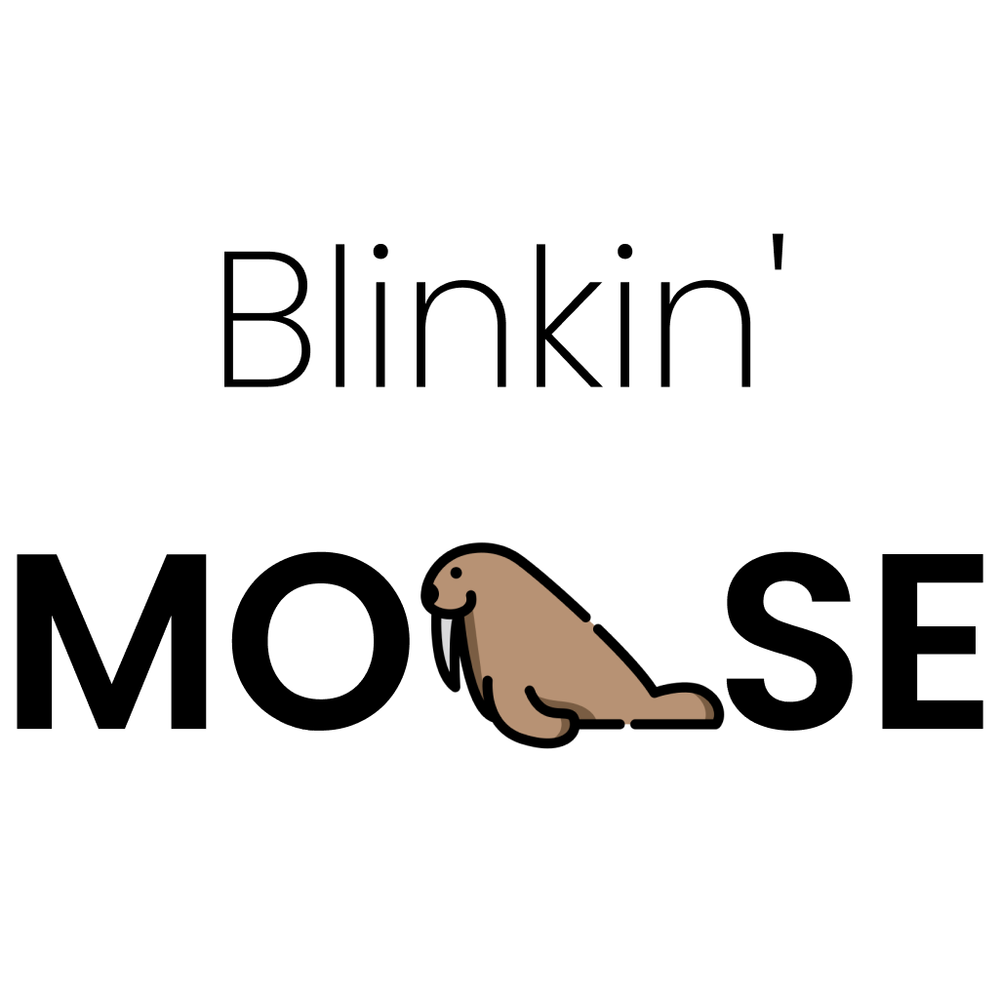

# **Blinkin' Morse**




<br>

The project built using flutter. It's only contains two routes and a loading page. When we write a text then the flashlight should be seen according to the mores code of the text we have written.

### Features
- Two page application

- it can convert normal text to morse code and display it

- It can read the converted code and with the help of the flashlight of the mobile device it can flash it out the code pattern

<!--  -->

## Team members
1. [Alwin John](https://github.com/Dexters-Hub)
2. [Annie George](https://github.com/Ann-T-George)

## Team Id
Flutter / 58

## Link to product walkthrough
[Code Explanation + Demo](https://www.loom.com/share/640f06464d68489f8996e7b44d58f836)

## How it Works ?
1. From a TextField widget - accepting a text from the user

2. Passing the text to a morse code encoder using the morse package

3. Storing & Displaying the converted code to the app

4. Encoded message is then read character by character and flashlight is seen according to the morse code using torch_light package

## Packages Used

morse: [^0.1.4+1](https://pub.dev/packages/morse)
torch_light: [^0.4.0](https://pub.dev/packages/torch_light)
flutter_launcher_icons: [^0.9.2](https://pub.dev/packages/flutter_launcher_icons)

## How to configure
Step 1:
```
git clone https://github.com/Ann-T-George/tinkerhub_co_coder.git
```

Step 2: (Do install the latest [flutter](https://docs.flutter.dev/get-started/install) version in your PC/Laptop then)
```
flutter pub get
```


## How to Run

After configuration run the following command with your device connected on

```
flutter run --no-sound-null-safety
```
(First, you should read through the guide to [understand unsound null safety.](https://dart.dev/null-safety/unsound-null-safety) If you are sure that you want to run your application with unsound null safety, you can use the following command:)
